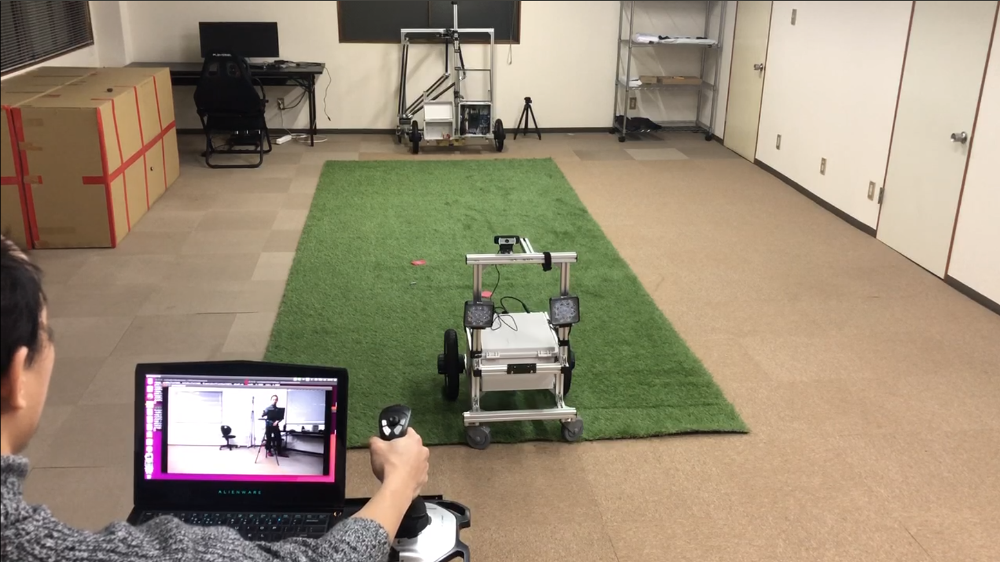
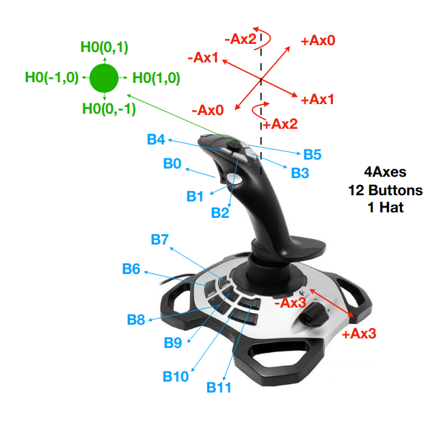

# ATCart-teleoperate

This is a simple teleoperation code to control ATCart with external joystick from your PC.

## Requirements

*** Note ***
I assume that you have the ATCart system with you, so you already have a basic component to control the UGV with an RC transmitter, or please check on [this]() for making sure you have everything.

1. any webcam plug on the robot PC.
2. we need gstreamer on both robot and base station PCs, so we can stream a front webcam view to the base station PC. So please install gsteamer for both sides.
3. choose any of joystick you'd like to use, and we need pygame to get the joystick value.

## Before Run
According to each joystick, we may have different joystick and input might be different. You can run `python3 joystickChecking.py` on your pc with a joystick plugged on. In my case, I am using Logitech Extreme 3d Pro as shown in this figure. I have 4 axes, 12 bottons and 1 hat.

With this joystick I will use axis0 and axis1 for throttle and curve-driven and axis2 for skidding. To make sure we don't accidentally push the stick, we need to grab a B0 as a trigger and move an axis0 or axis1 to drive the UGV. To make sure we want to drive in skidding not mixing with curve-driven, we need to grab B0 and push B1 in the same time while twisting an axis2.

Open `gstreamerHostWebcam.sh` with your favorite editor, we need to change the `udpsink host=192.168.8.181` to your base station PC ip address. If you're using linux machine, the other setting should be fine as default, otherwise you may need to check an error and try to fix it :).

Open `teleopControl.py` with your favorite editor again and we need to change `JETSON_NANO = "192.168.8.162"` at line 161 according to your robot PC ip address. Note that the `maxRPM` is defined at line 27 as 60.0rpm, so you can change this as you like, so when the axis1 is fully pushed forward, the UGV will go with this `maxRPM`. Similar with `maxSkidRPM`, this is set as half of `maxRPM`, so when you fully twist axis2, it will turn around with this speed. Feel free to change this as you like, but keeo in mind that the maximum speed of this brushless wheel is 144rpm, so even you go beyond that, it will keep limited as 144rpm.

## Run
On robot PC, we need to run `./gstreamerHostWebcam.sh` to start streaming a webcam. Open another terminal and run `python3 middleCom.py` to start receiving the joystick value from UDP socket. 

On base station PC, we start `./gstreamerClient.sh` to receive the camera view from robot PC. Then run `python3 teleopControl.py` to convert the joystick value to wheel's rpm and send to robot PC via UDP socket. Finally, you can drive the robot around as long as your wifi signal cover the range.